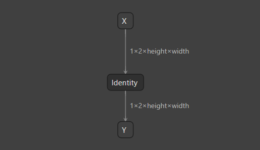

# Inspecting A TensorRT Engine


## Introduction

`inspect model` 子工具可以加载并显示有关 TensorRT 引擎（即 .plan 文件）的信息。


## Running The Example

1. 生成一个具有动态形状和2个配置文件的引擎：

    ```bash
    polygraphy run dynamic_identity.onnx --trt \
        --trt-min-shapes X:[1,2,1,1] --trt-opt-shapes X:[1,2,3,3] --trt-max-shapes X:[1,2,5,5] \
        --trt-min-shapes X:[1,2,2,2] --trt-opt-shapes X:[1,2,4,4] --trt-max-shapes X:[1,2,6,6] \
        --save-engine dynamic_identity.engine
    ```

2. 检查引擎：

    ```bash
    polygraphy inspect model dynamic_identity.engine \
        --show layers
    ```

    > 注意：`--show layers` 仅在引擎构建时使用了非 `NONE` 的 `profiling_verbosity` 时有效。 更高的详细程度会使更多的逐层信息可用。
    
这将显示类似以下内容：
    
```
    [I] ==== TensorRT Engine ====
        Name: Unnamed Network 0 | Explicit Batch Engine
    
    ---- 1 Engine Input(s) ----
        {X [dtype=float32, shape=(1, 2, -1, -1)]}
    
    ---- 1 Engine Output(s) ----
        {Y [dtype=float32, shape=(1, 2, -1, -1)]}
    
    ---- Memory ----
        Device Memory: 0 bytes
    
    ---- 2 Profile(s) (2 Tensor(s) Each) ----
        - Profile: 0
            Tensor: X          (Input), Index: 0 | Shapes: min=(1, 2, 1, 1), opt=(1, 2, 3, 3), max=(1, 2, 5, 5)
            Tensor: Y         (Output), Index: 1 | Shape: (1, 2, -1, -1)
    
    - Profile: 1
            Tensor: X          (Input), Index: 0 | Shapes: min=(1, 2, 2, 2), opt=(1, 2, 4, 4), max=(1, 2, 6, 6)
            Tensor: Y         (Output), Index: 1 | Shape: (1, 2, -1, -1)
    
    ---- 1 Layer(s) Per Profile ----
        - Profile: 0
            Layer 0    | node_of_Y [Op: Reformat]
                {X [shape=(1, 2, -1, -1)]}
                 -> {Y [shape=(1, 2, -1, -1)]}
    
    - Profile: 1
            Layer 0    | node_of_Y [profile 1] [Op: Reformat]
                {X [profile 1] [shape=(1, 2, -1, -1)]}
                 -> {Y [profile 1] [shape=(1, 2, -1, -1)]}
    ```
    
还可以使用 `--show layers attrs` 显示更详细的层信息。


