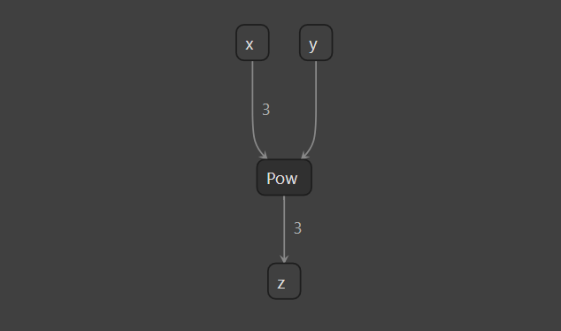

# Inspecting Tactic Replay Files


## Introduction

`inspect tactics` 子工具可以显示关于由 Polygraphy 生成的 TensorRT 策略回放（ tactic replay）文件的信息


## Running The Example

1. 生成一个策略回放文件：

    ```bash
    polygraphy run model.onnx --trt --save-tactics replay.json
    ```

2. 检查策略回放：

    ```bash
    polygraphy inspect tactics replay.json
    ```

    This will display something like:

    ```
    [I] Layer: (Unnamed Layer* 0) [Shuffle]
            Algorithm: (Implementation: 2147483661, Tactic: 0) | Inputs: (('TensorFormat.LINEAR', 'DataType.FLOAT'),) | Outputs: (('TensorFormat.LINEAR', 'DataType.FLOAT'),)
        Layer: node_of_z
            Algorithm: (Implementation: 2147483651, Tactic: 1) | Inputs: (('TensorFormat.LINEAR', 'DataType.FLOAT'), ('TensorFormat.LINEAR', 'DataType.FLOAT')) | Outputs: (('TensorFormat.LINEAR', 'DataType.FLOAT'),)
    ```



**Q：策略回放是什么？为什么需要策略回放？**

策略回放（Tactic Replay）是TensorRT中的一个功能，它允许用户记录并重放在模型优化和编译过程中选择的特定算法策略。这些策略是TensorRT优化器选择的用于执行不同层操作的具体方法和实现。每种策略都有可能影响性能和精度。策略回放的目的是提供一种方法来确保模型的构建是可重复的，特别是在跨不同平台或环境部署模型时。

这里有一些使用策略回放的原因：

1. **可重复性**：策略回放确保了模型优化的一致性。当开发者在不同的硬件或软件环境下重建模型时，策略回放可以确保使用相同的优化策略，从而得到性能一致的模型。

2. **调试**：如果在特定的策略下模型行为异常（例如，如果某些策略导致精度下降或性能问题），开发者可以使用策略回放来识别并调试问题。

3. **性能调优**：开发者可以比较不同策略的性能，并选择最适合特定应用的策略。一旦找到最优策略，就可以通过策略回放来确保在每次构建中都使用它。

4. **版本控制和审核**：在某些用例中，尤其是在合规性和审核要求较高的环境中，能够记录并展示模型是如何被优化和编译的，这一点是非常重要的。

5. **简化部署**：当需要在多个设备上部署模型时，策略回放文件可以简化部署过程，因为它消除了在每个设备上单独优化模型的需要。

策略回放是为了确保模型优化和编译过程的透明性、可重复性和效率，特别是在进行模型优化和部署的工程化过程中。
