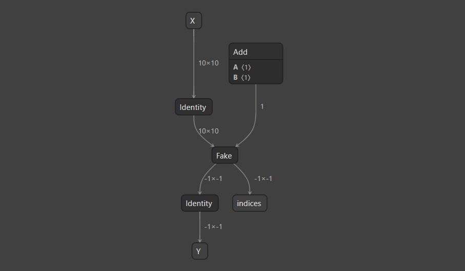

# Inspecting TensorRT ONNX Support

## Introduction

`inspect capability` 子工具提供了关于 TensorRT 对给定 ONNX 图中 ONNX 操作符支持的详细信息。它还会将原始模型中支持和不支持的子图分区并保存。


## Running The Example

1. 生成能力报告

    ```bash
    polygraphy inspect capability model.onnx
    ```

    这应该显示一个汇总表，如下所示：

    ```
    [I] ===== Summary =====
        Operator | Count   | Reason                                                                                                                                                            | Nodes
        -----------------------------------------------------------------------------------------------------------------------------------------------------------------------------------------------
        Fake     |       1 | In node 0 (importFallbackPluginImporter): UNSUPPORTED_NODE: Assertion failed: creator && "Plugin not found, are the plugin name, version, and namespace correct?" | [[2, 3]]
    ```

## Understanding The Output

在这个示例中，`model.onnx` 包含一个不被 TensorRT 支持的 `Fake` 节点。汇总表显示了不支持的操作符，不支持的原因，它在图中出现的次数，以及这些节点在图中的索引范围，以防有多个连续的不支持节点。请注意，此范围使用包含起始索引和排除终止索引。

要获取更多信息和选项，请参见 `polygraphy inspect capability --help`。

```
[I] ===== 汇总 =====
    操作符 | 数量   | 原因                                                                                                                                                            | 节点
    -----------------------------------------------------------------------------------------------------------------------------------------------------------------------------------------------
    Fake     |       1 | 在节点 0 (importFallbackPluginImporter): UNSUPPORTED_NODE: 断言失败: creator && "插件未找到，插件名称、版本和命名空间是否正确？" | [[2, 3]]

```


