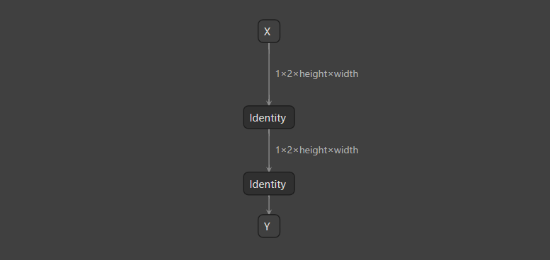

# Comparing Frameworks

## Introduction

您可以使用 `run` 子工具来比较不同框架中的模型。在最简单的情况下，您可以提供一个模型和一个或多个框架标志。默认情况下，它将生成合成输入数据，使用指定的框架运行推理，然后比较指定框架的输出。

## Running The Example

在这个示例中，我们将概述 `run` 子工具的各种常见用例：

- [比较 TensorRT 和 ONNX-Runtime 输出](https://chat.openai.com/c/11e314f1-07f1-4ff1-a207-87d603b256a6#比较-tensorrt-和-onnx-runtime-输出)
- [比较 TensorRT 精度](https://chat.openai.com/c/11e314f1-07f1-4ff1-a207-87d603b256a6#比较-tensorrt-精度)
- [更改容忍度](https://chat.openai.com/c/11e314f1-07f1-4ff1-a207-87d603b256a6#更改容忍度)
- [更改比较度量](https://chat.openai.com/c/11e314f1-07f1-4ff1-a207-87d603b256a6#更改比较度量)
- [在 ONNX-Runtime 和 TensorRT 之间比较逐层输出](https://chat.openai.com/c/11e314f1-07f1-4ff1-a207-87d603b256a6#在-onnx-runtime-和-tensorrt-之间比较逐层输出)

### Comparing TensorRT And ONNX-Runtime Outputs

要在 Polygraphy 中使用两种框架运行模型并执行输出比较：

```bash
polygraphy run dynamic_identity.onnx --trt --onnxrt
```

`dynamic_identity.onnx` 模型具有动态输入形状。默认情况下，Polygraphy 将覆盖模型中的任何动态输入维度为 `constants.DEFAULT_SHAPE_VALUE`（定义为 `1`），并向您发出警告：

<!-- Polygraphy Test: Ignore Start -->
```
[W]     Input tensor: X (dtype=DataType.FLOAT, shape=(1, 2, -1, -1)) | No shapes provided; Will use shape: [1, 2, 1, 1] for min/opt/max in profile.
[W]     This will cause the tensor to have a static shape. If this is incorrect, please set the range of shapes for this input tensor.
```
> 未提供形状；将使用形状：[1, 2, 1, 1] 作为配置文件中的 min/opt/max。
>
> 这将导致张量具有静态形状。如果这是不正确的，请为此输入张量设置形状范围。

<!-- Polygraphy Test: Ignore End -->

为了抑制这条消息并明确向 Polygraphy 提供输入形状，请使用 `--input-shapes` 选项：

```
polygraphy run dynamic_identity.onnx --trt --onnxrt \
    --input-shapes X:[1,2,4,4]
```

### Comparing TensorRT Precisions

要构建具有降低精度层的 TensorRT 引擎以便与 ONNXRT 进行比较，请使用支持的精度标志之一（`--tf32`、`--fp16` 或 `--int8`）。例如：

```bash
polygraphy run dynamic_identity.onnx --trt --fp16 --onnxrt \
    --input-shapes X:[1,2,4,4]
```

> :warning: 通常，使用 INT8 精度获得可接受的准确性需要一个额外的校准步骤： 
>
> 请参阅[开发者指南](https://docs.nvidia.com/deeplearning/tensorrt/developer-guide/index.html#working-with-int8) 和关于[如何进行校准](https://chat.openai.com/examples/cli/convert/01_int8_calibration_in_tensorrt) 在 Polygraphy 命令行上的说明。

### Changing Tolerances

`run` 默认使用的容忍度通常适用于 FP32 精度，但可能不适合降低的精度。为了放宽容忍度，您可以使用 `--atol` 和 `--rtol` 选项分别设置绝对和相对容忍度

### Changing Comparison Metrics

您可以使用 `--check-error-stat` 选项更改用于比较的度量。默认情况下，Polygraphy 使用“逐元素”度量（`--check-error-stat elemwise`）。

其他可能的 `--check-error-stat` 度量包括 `mean`、`median` 和 `max`，分别比较了整个张量的平均、中位数和最大绝对/相对误差。

为了更好地理解这一点，假设我们正在比较两个输出 `out0` 和 `out1`。Polygraphy 取这些张量的逐元素绝对和相对差异：

<!-- Polygraphy Test: Ignore Start -->
```
absdiff = out0 - out1
reldiff = absdiff / abs(out1)
```
<!-- Polygraphy Test: Ignore End -->

然后，对于输出中的每个索引 `i`，Polygraphy 检查是否 `absdiff[i] > atol and reldiff[i] > rtol`。如果任何索引满足此条件，则比较将失败。这比比较整个张量的最大绝对和相对误差（`--check-error-stat max`）要宽松，因为如果*不同*的索引 `i` 和 `j` 分别满足 `absdiff[i] > atol` 和 `reldiff[j] > rtol`，则 `max` 比较将失败，但 `elemwise` 比较可能通过。

综合起来，下面的示例在使用 FP16 的 TensorRT 和 ONNX-Runtime 之间运行 `median` 比较，使用绝对和相对容忍度为 `0.001`：

```bash
polygraphy run dynamic_identity.onnx --trt --fp16 --onnxrt \
    --input-shapes X:[1,2,4,4] \
    --atol 0.001 --rtol 0.001 --check-error-stat median
```

> 您还可以为 `--atol`/`--rtol`/`--check-error-stat` 指定每个输出的值。 有关更多信息，请参阅 `run` 子工具的帮助输出。

### Comparing Per-Layer Outputs Between ONNX-Runtime And TensorRT

当网络输出不匹配时，比较逐层输出以查看错误是在哪里引入的可能很有用。为此，您可以分别使用 `--trt-outputs` 和 `--onnx-outputs` 选项。这些选项接受一个或多个输出名称作为其参数。特殊值 `mark all` 表示应比较模型中的所有张量：

```bash
 polygraphy run dynamic_identity.onnx --trt --onnxrt \
     --trt-outputs mark all \
     --onnx-outputs mark all
```

为了更容易找到第一个不匹配的输出，您可以使用 `--fail-fast` 选项，这将导致工具在输出之间出现第一个不匹配后退出。

请注意，使用 `--trt-outputs mark all` 有时可能会扰乱生成的引擎，因为时间差异、层融合选择和格式限制的差异可能会隐藏故障。在这种情况下，您可能需要使用更复杂的方法来对失败的模型进行二分，并生成一个能够重现错误的简化测试用例。请参阅 [Reducing Failing ONNX Models](../../../cli/debug/02_reducing_failing_onnx_models) 了解如何使用 Polygraphy 来做到这一点的教程。

## Further Reading

* 在某些情况下，您可能需要跨多个 Polygraphy 运行进行比较
  （例如，当比较预构建的 TensorRT 引擎或[Polygraphy 网络脚本](../../../cli/run/04_defining_a_tensorrt_network_or_config_manually)与 ONNX-Runtime 的输出）。请参阅 [Comparing Across Runs](../../../cli/run/02_comparing_across_runs) 了解如何实现此目的的教程。
  
* 有关在 TensorRT 中处理动态形状的更多详细信息：
  * 请参阅 [Dynamic Shapes in TensorRT](../../../cli/convert/03_dynamic_shapes_in_tensorrt/) 了解如何使用 Polygraphy CLI 为引擎指定优化配置文件
  * 请参阅 [TensorRT and Dynamic Shapes](../../../api/07_tensorrt_and_dynamic_shapes/) 了解如何使用 Polygraphy API 来做这件事的详细信息

* 有关如何提供真实输入数据的详细信息，请参阅 [Comparing with Custom Input Data](../05_comparing_with_custom_input_data/)。

* 请参阅 [Debugging TensorRT Accuracy Issues](../../../how-to/debug_accuracy.md) 了解一个更广泛的教程，关于如何使用 Polygraphy 调试精度问题。



